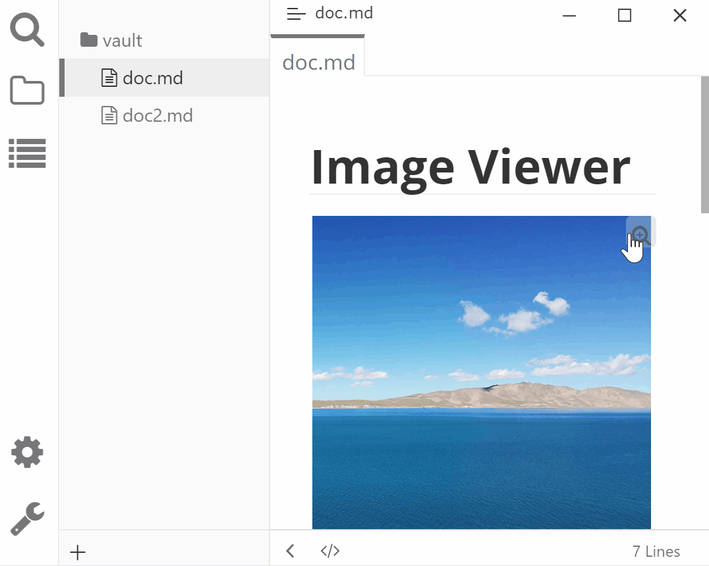

# Typora Plugin Image Viewer

English | [简体中文](./README.zh-CN.md)

This a plugin based on [typora-community-plugin][core] for [Typora](https://typora.io).

View all the images in the current Markdown.

Useage:

- Click the button on the image's top-right corner to preview the image.

  > Suporrt `` and ``

- Click the image to preview the image.

  > Support images wrapped in html tag, like `

`

## Preview

## Install

1. Install [typora-community-plugin][core]
2. Open "Settings -> Plugin Marketplace" search "Image Viewer" then install it.

[core]: https://github.com/typora-community-plugin/typora-community-plugin
