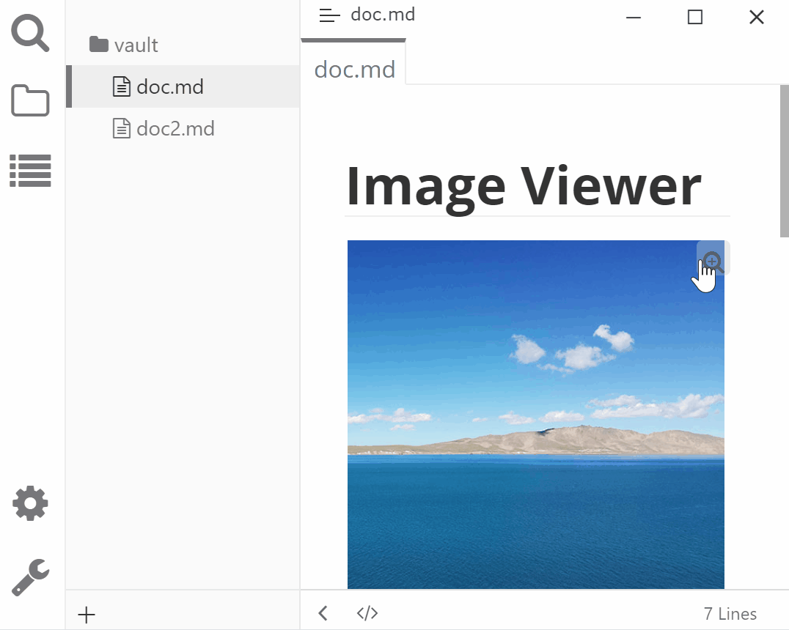

# Typora Plugin Image Viewer

[English](./README.md) | 简体中文

这是一个基于 [typora-community-plugin][core] 开发的，适用于 [Typora](https://typora.io) 的插件。

可以查看当前文档中的所有图片。

使用方法：

- 点击图片右上角按钮，查看大图

  > 支持语法 `` 和 ``

- 点击图片查看大图

  > 支持被 HTML 包裹的图片，如 `

`。

## 预览

## 安装

1. 安装 [typora-community-plugin][core]
2. 在 “设置 -> 插件市场” 中搜索 “Image Viewer 并安装

[core]: https://github.com/typora-community-plugin/typora-community-plugin
